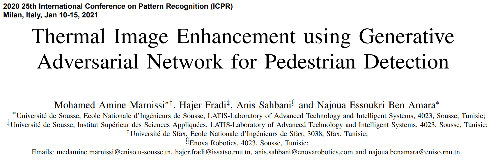
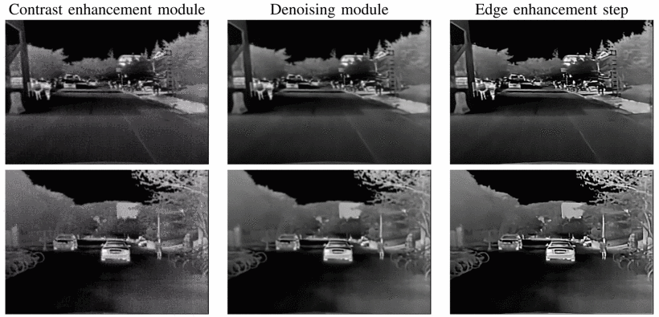
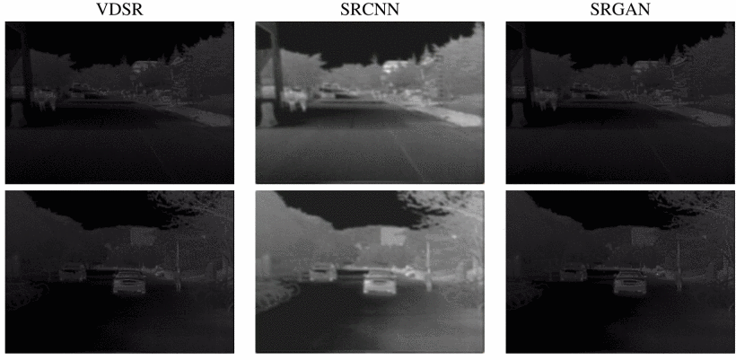
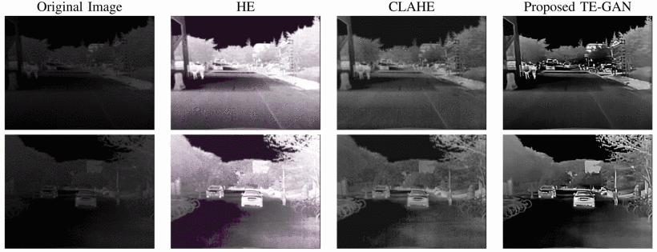
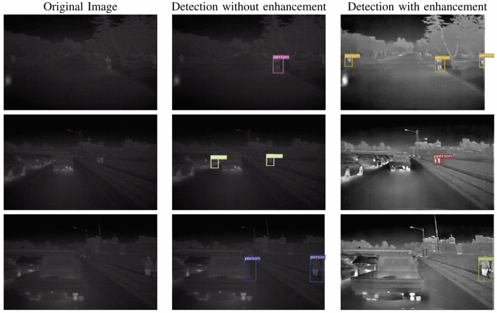

# <a href="https://ieeexplore.ieee.org/document/9412331"> Thermal Image Enhancement using Generative Adversarial Network for Pedestrian Detection </a>
## This implementation for our ICPR 2021 paper, training YOLOv3 on KAIST dataset

### The short introduction of paper 
[](https://www.youtube.com/watch?v=e5yBbxVOcUY&ab_channel=ArtificialIntelligence "Click to play on Youtube.com")

# TE-GAN
Thermal Image Enhancement using Generative Adversarial Network for Pedestrian Detection


### Our reported result on on KAIST dataset:

#### Details of intermediate results from the proposed TE-GAN architecture:


 #### Qualitative results of different super-resolution methods:


 #### Results of the Proposed Te-Gan Architecture:

|     | HE | CLAHE | TE-GAN
| --- | --- | --- | --- |
|PSNR | 7.81 | 11.92 | 13.92 |
|SSIM | 0.34 | 0.37 | 0.50 |

#### Qualitative results of our proposed architecture TE-GAN:


 #### Results of Pedestrian Detection:

|Testing condions| Metri | Without enhancement | With enhancement
| --- | --- | --- | --- |
|Day | mAP| 0.61 | 0.63 |
|    | LAMR| 0.41 | 0.40 |
|Night | mAP| 0.66 | 0.73 |
|    | LAMR| 0.26 | 0.20 |
|All | mAP| 0.62 | 0.65 |
|    | LAMR| 0.45 | 0.43 |
  #### Some results of pedestrian detection using yolov3 on thermal images from KAIST dataset:


#### Dataset
- [Training Set](https://drive.google.com/drive/folders/1mP2_V2ls0cNB5EKuEsXjnOr40b3MpHlc?usp=sharing)
- [Kaist dataset](https://drive.google.com/file/d/14A3K2IPPPC8-BwPh-YjeHARaZqjnR655/view?usp=sharing)

## Citation
We really hope this repository is useful for you. Please cite our paper as
```
@INPROCEEDINGS{9412331,
  author={Marnissi, Mohamed Amine and Fradi, Hajer and Sahbani, Anis and Ben Amara, Najoua Essoukri},
  booktitle={2020 25th International Conference on Pattern Recognition (ICPR)}, 
  title={Thermal Image Enhancement using Generative Adversarial Network for Pedestrian Detection}, 
  year={2021}
  }

```

If you have any comment or question about this repository, please leave it in Issues.

Other contribution, please contact me by email: mohamed.amine.marnissi@gmail.com.

Thank you so much for your interest in our work.
